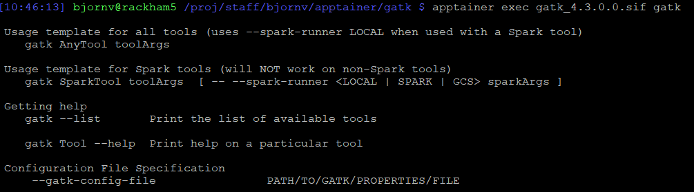

# Containers

## Why?
Do you need a program that has a very complicated and exhausting install? Or maybe your installation requires root privileges?

Within a container you can install whatever you want and send it to whichever computer you want to run it from. 

## How?
You can either download an existing container containing your software of interest or build one yourself. 

## Docker vs Singularity/Apptainer
Docker requires root privileges and therefore are run on local computers or the cloud.

HPC-clusters without root privileges uses Apptainer. 

## Public repositories
Docker is the most common and has the biggest repository: [https://hub.docker.com/]

Apptainer/Singularity uses: [https://cloud.sylabs.io/library]

Luckily, Apptainer can convert docker containers into Apptainer containers. 

Anyone can upload a container to the repositories. So be cautious and look for verified publishers. 

## Example: I want gatk on bianca. 

Remember, no internet on bianca. Build on rackham and then transfer the container to the wharf. 

Can I find it on syslabs.io?
[https://cloud.sylabs.io/library/search?q=gatk]

No. Continue to Dockerhub.

Dockerhub?
[https://hub.docker.com/r/broadinstitute/gatk/]

Perfect.

 


`apptainer pull gatk_4.3.0.0.sif docker://broadinstitute/gatk:4.3.0.0`


`sftp` to the wharf:


`apptainer exec gatk_4.3.0.0.sif gatk`



## Set the Apptainer cache dirs to /proj/proj-id to prevent quota issues
```
mkdir -p /proj/staff/bjornv/apptainer_cache_dir/{cache,tmp,localcache}
export APPTAINER_CACHEDIR=	/proj/staff/bjornv/apptainer_cache_dir/cache
export APPTAINER_TMPDIR=	/proj/staff/bjornv/apptainer_cache_dir/tmp
export APPTAINER_LOCALCACHEDIR=	/proj/staff/bjornv/apptainer_cache_dir/localcache
```
