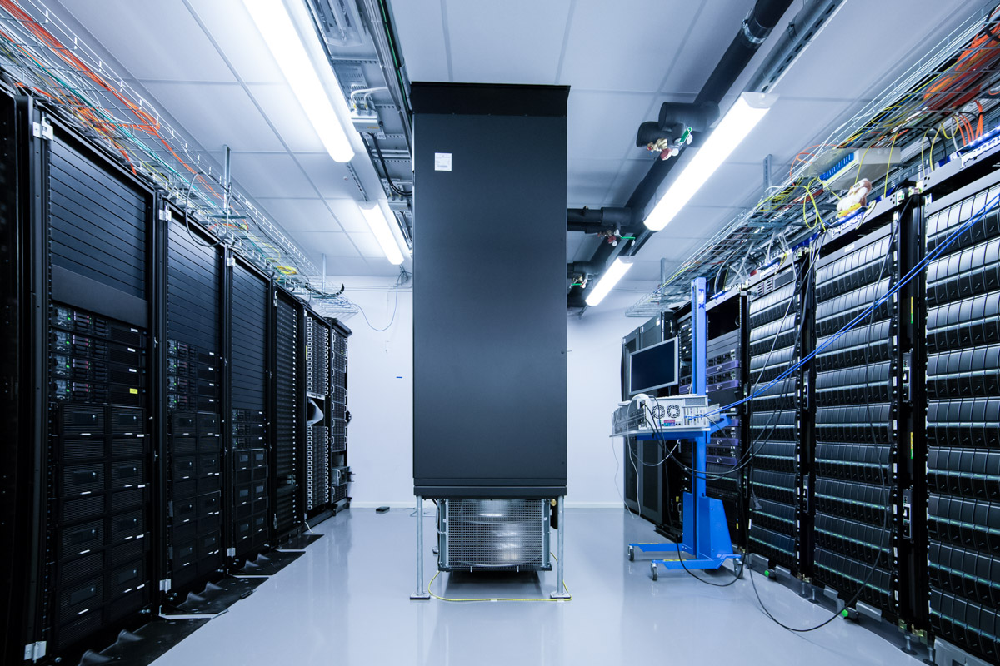

# Snowy Hardware

Nodes    | CPUs    |  Cores |  Memory     | Scratch    | GPUs | Name | Comment
--------------- | --------------- | --------------- | --------------- |--------------- |--------------- |--------------- |---------------
122 |  2x Xeon E5-2660 2.2 GHz  | 16 (2 x 8)    | 128GB | 3/4TB | N/A | s1-s12, s14-s40, s42-s120, s201-s204| .
49 |  2x Xeon E5-2660 2.2 GHz  | 16 (2 x 8)    | 128GB | 3/4TB | Tesla T4 | s151-s163, s164-s200| .
15 |  2x Xeon E5-2660 2.2 GHz  | 16 (2 x 8)    | 512GB | 3/4TB | N/A | s121-s129, s131, s133-s137 | `-C mem512GB` or `-C fat`
12 |  2x Xeon E5-2660 2.2 GHz  | 16 (2 x 8)    | 256GB | 3/4TB | N/A | s139-s150 | `-C mem256GB` or `-C fat`
1 |  2x Xeon E5-2660 2.2 GHz  | 80 (10 x 8)    | 4TB | 3/4TB | N/A | s229 | `-C mem4TB -p veryfat`
1 |  2x Xeon E5-2660 2.2 GHz  | 16 (2 x 8)    | 256GB | 3/4TB | Tesla T4 | s138 | `-C mem256GB` or `-C fat`

* Job walltime : 30 days (720 hrs)  
* interactive walltime : 12 hrs  
* `-p devel` or `-p devcore` walltime : 1 hr  
* No `-t` walltime : 1 hr  
* Total jobs allowed (running and waiting) : 5000  
* Path to node-local temp disk space (scratch folder) : `$SNIC_TMP`

GPU on Snowy: NVIDIA T4 (16GB)

Performance in TFLOPS and TOPS (1012 operations per sec):  
| Data type | A100          | T4   |
| --------  | ------------- | ---- |
|      FP64 | 9.7 \| 19.5\* | 0.25 |
|      FP32 | 19.5          | 8.1  |
|      TF32 | 156\*\*       | N/A  |
|      FP16 | 312\*\*       | 65   |
|      BF16 | 312\*\*       | N/A  |
|      Int8 | 624\*\*       | 130  |
|      Int4 | 1248\*\*      | 260  |

\*Performance on Tensor Core.  
\*\*Up to a factor of two faster with sparsity.

Submitting jobs : https://docs.uppmax.uu.se/cluster_guides/slurm_on_snowy/