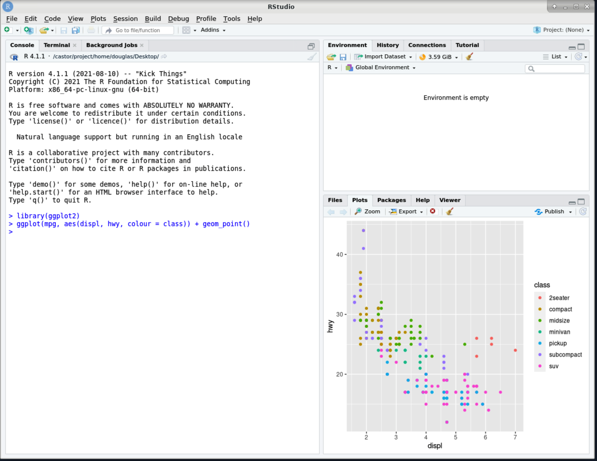

# Working with the modules on Bianca

!!! info "Objectives" 

    - Using module system commands
    - Use software in the module system for some typical workflows
       
- 800+ programs and packages are installed, with usually many versions of each.
- To avoid chaos and collisions, they are managed by a **module system** called [LMOD](https://lmod.readthedocs.io/en/latest/).
- By default, the only software available on Bianca and other UPPMAX clusters are standard Linux tools.
- **All other software** is made available by using the module system.
- This means users must explicitly request software, together with software versions, that they require.
- This turns out to be quite easy to do. It also improves readability and reproducibility.
- Nearly all software in the module system is available on all UPPMAX clusters.


!!! warning 
    - To access bioinformatics tools, load the **bioinfo-tools** module first.


### Modules

- [Software at UPPMAX](https://www.uppmax.uu.se/resources/software/)
- [Module system](https://www.uppmax.uu.se/resources/software/module-system/)

#### Some commands

The `module` command is the basic interface to the module system.
The `ml` shortcut command is also available.

- list all modules immediately available, or search for a specific available module
    - `module avail` or `ml av`
    - `module avail *tool*` or `ml av *tool*`

This command is not so smart, though, especially when searching for a specific tool, or a bioinformatics tool.
It only reports modules that are immediately available.

```
$ ml av R
```
outputs everything that has an `r` in the name... not useful.

```
$ ml av samtools
No module(s) or extension(s) found!
Use "module spider" to find all possible modules and extensions.
Use "module keyword key1 key2 ..." to search for all possible modules matching any of the "keys".
```

It is better to use `module spider` or `ml spider`.
If there is an exact match, it reports it first.

```
$ ml spider R

-------------------------------------------
  R:
-------------------------------------------
     Versions:
        R/3.0.2
        R/3.2.3
        R/3.3.2
        R/3.4.0
        R/3.4.3
        R/3.5.0
        R/3.5.2
        R/3.6.0
        R/3.6.1
        R/4.0.0
        R/4.0.4
        R/4.1.1
        R/4.2.1
     Other possible modules matches:
        454-dataprocessing  ADMIXTURE  ANTLR  ARCS  ARC_assembler  ARPACK-NG  ART  AdapterRemoval  AlienTrimmer  Amber  AnchorWave  Arlequin  Armadillo  ArrowGrid  Bamsurgeon  BclConverter  BioBakery  BioBakery_data  ...

-------------------------------------------
  To find other possible module matches execute:

      $ module -r spider '.*R.*'

-------------------------------------------
  For detailed information about a specific "R" package (including how to load the modules) use the module's full name.
  Note that names that have a trailing (E) are extensions provided by other modules.
  For example:

     $ module spider R/4.2.1
-------------------------------------------
```

```
$ ml spider samtools

-------------------------------------------
  samtools:
-------------------------------------------
     Versions:
        samtools/0.1.12-10
        samtools/0.1.19
        samtools/1.1
        samtools/1.2
        samtools/1.3
        samtools/1.4
        samtools/1.5_debug
        samtools/1.5
        samtools/1.6
        samtools/1.8
        samtools/1.9
        samtools/1.10
        samtools/1.12
        samtools/1.14
        samtools/1.16
        samtools/1.17
     Other possible modules matches:
        SAMtools

-------------------------------------------
  To find other possible module matches execute:

      $ module -r spider '.*samtools.*'

-------------------------------------------
  For detailed information about a specific "samtools" package (including how to load the modules) use the module's full name.
  Note that names that have a trailing (E) are extensions provided by other modules.
  For example:

     $ module spider samtools/1.17
-------------------------------------------
```

The final bit of output tells us more about a specific module version, including the special step required to access all bioinformatics modules.

```
$ ml spider samtools/1.17

-------------------------------------------
  samtools: samtools/1.17
-------------------------------------------

    You will need to load all module(s) on any one of the lines below before the "samtools/1.17" module is available to load.

      bioinfo-tools

    Help:
        samtools - use samtools 1.17

        Version 1.17
```

This reminds us that we need to load the `bioinfo-tools` module to be able to load `samtools/1.17`.
Again, this is required (just once) before loading bioinformatics software.

- Load a module 
    - `module load <module name>` or `ml <module name>`

When loading a module, there is a "default" module available, which is almost always the latest version.
However, we rarely want to rely on that.
For reproducibility, we want to load specific version of our bioinformatics tools.
To load the `samtools/1.17` module, which is a bioinformatics module.

```
$ ml bioinfo-tools
$ ml samtools/1.17
```

- List the loaded modules
    - `module list` or simply `ml`

```
$ ml

Currently Loaded Modules:
  1) uppmax   2) bioinfo-tools   3) samtools/1.17
```

To load `GATK/4.3.0.0` now, `bioinfo-tools` is not required because it is already loaded.
Loading this module also shows that sometimes, loading a module results in a message that is helpful for using the module at UPPMAX.

```
$ ml GATK/4.3.0.0
Note that all versions of GATK starting with 4.0.8.0 use a different wrapper
script (gatk) than previous versions of GATK.  You might need to update your
jobs accordingly.

The complete GATK resource bundle is in /sw/data/GATK

See 'module help GATK/4.3.0.0' for information on activating the GATK conda
environment for using DetermineGermlineContigPloidy and similar other tools.
```

This message references the command `module help GATK/4.3.0.0` for additional help with this module.
All modules have at least a brief help message. Some (such as GATK/4.3.0.0) have more extensive help that guides users using features of the modules at UPPMAX.
It is *not* general help for using the tool itself.

- Display a brief module-specific help.
    - `module help <module name>` or `ml help <module name>` 
 

```
$ ml help GATK/4.3.0.0

-------------- Module Specific Help for "GATK/4.3.0.0" ---------------
GATK - use GATK 4.3.0.0
Version 4.3.0.0

**GATK 4.3.0.0**

Usage:

    gatk --help     for general options, including how to pass java options

    gatk --list     to list available tools

    gatk ToolName -OPTION1 value1 -OPTION2 value2 ...
                  to run a specific tool, e.g., HaplotypeCaller, GenotypeGVCFs, ...

For more help getting started, see

    https://software.broadinstitute.org/gatk/documentation/article.php?id=9881

...
```

When we list the modules loaded with `ml`, we see that `GATK/4.3.0.0` is now loaded, as is its prerequisite module `java/sun_jdk1.8.0_151`.

```
$ ml

Currently Loaded Modules:
  1) uppmax   2) bioinfo-tools   3) samtools/1.17   4) java/sun_jdk1.8.0_151   5) GATK/4.3.0.0
```

Modules can also be unloaded, which also unloads their prerequisites.

- Unload a module 
    - `module unload <module name>` or `ml -<module name>`

### Installed software

You can find almost all installed software at:

    - <https://www.uppmax.uu.se/resources/software/installed-software/>
  
#### Installed databases

You can find almost all installed databases at:

    - [Installed databases at UPPMAX](https://www.uppmax.uu.se/resources/databases/)
    
### Workflows    

???+ question "Hands on: Processing a BAM file to a VCF using GATK, and annotating the variants with snpEff"

    This workflow uses a pre-made BAM file that contains a subset of reads from a sample from European Nucleotide Archive project [PRJEB6463](https://www.ebi.ac.uk/ena/browser/view/PRJEB6463) aligned to human genome build hg38. These reads are from the region `chr1:100300000-100800000`.

    1. Copy example BAM file to your working directory.
    ```
    $ cp -a /proj/sens2023531/workshop/data/ERR1252289.subset.bam .
    ```

    2. Take a quick look at the BAM file. First see if `samtools` is available.
    ```
    $ which samtools
    ```

    3. If `samtools` is not found, load `bioinfo-tools` then `samtools/1.17`
    ```
    $ ml bioinfo-tools samtools/1.17
    ```

    4. Now examine the first 10 reads aligned within the BAM file.
    ```
    $ samtools view ERR1252289.subset.bam | head
    ```

    5. Looks good. Now load the `GATK/4.3.0.0` module.
    ```
    $ module load GATK/4.3.0.0
    ```

    6. Make symbolic links to hg38 genome resources already available on UPPMAX. This provides local symbolic links for the hg38 resources `genome.fa`, `genome.fa.fai` and `genome.dict`.
    ```
    $ ln -s /sw/data/iGenomes/Homo_sapiens/UCSC/hg38/Sequence/WholeGenomeFasta/genome.* .
    ```

    7. Create a VCF containing inferred variants. Speed it up by confining the analysis to this region of chr1.
    ```
    $ gatk HaplotypeCaller --reference genome.fa --input ERR1252289.subset.bam --intervals chr1:100300000-100800000 --output ERR1252289.subset.vcf
    ```
    This produces as its output the files `ERR1252289.subset.vcf` and `ERR1252289.subset.vcf.idx`.

    8. Now use `snpEff/5.1` to annotate the variants. Loading `snpEff/5.1` results in a change of java prerequisite. Also take a quick look at the help for the module for help with running this tool at UPPMAX.
    ```
    $ ml snpEff/5.1

    The following have been reloaded with a version change:
      1) java/sun_jdk1.8.0_151 => java/OpenJDK_12+32

    $ ml help snpEff/5.1

    ------------------- Module Specific Help for "snpEff/5.1" --------------------
        snpEff - use snpEff 5.1
        Version 5.1

        Usage: java -jar $SNPEFF_ROOT/snpEff.jar ...

        Usage: java -jar $SNPEFF_ROOT/SnpSift.jar ...
        along with the desired command and possible java options for memory, etc

        Note that databases must be added by an admin -- request via support@uppmax.uu.se
        See http://snpeff.sourceforge.net/protocol.html for general help

    Every database that is provided by snpEff/5.1 as of this installation is installed.  This complete list
    can be generated with

        java -jar $SNPEFF_ROOT/snpEff.jar databases

    Three additional databases have been installed.

        Database name                  Description                                      Notes
        -------------                  -----------                                      -----
        c_elegans.PRJNA13758.WS283     Caenorhabditis elegans genome version WS283      MtDNA uses Invertebrate_Mitochondrial codon table
        canFam4.0                      Canis familiaris genome version 4.0
        fAlb15.e73                     Ficedula albicollis ENSEMBLE 73 release

    The complete list of locally installed databases is available at $SNPEFF_ROOT/data/databases_list.installed

    To add your own snpEff database, see the guide at http://pcingola.github.io/SnpEff/se_buildingdb/#option-1-building-a-database-from-gtf-files
    ```

    9. Annotate the variants.
    ```
    $ java -jar $SNPEFF_ROOT/snpEff.jar eff hg38 ERR1252289.subset.vcf > ERR1252289.subset.snpEff.vcf
    ```

    10. Take a quick look!
    ```
    $ less ERR1252289.subset.snpEff.vcf
    ```

    11. Compress the annotated VCF and index it, using `bgzip` and `tabix` provided by the `samtools/1.17` module, already loaded.
    ```
    $ bgzip ERR1252289.subset.snpEff.vcf
    $ tabix -p vcf ERR1252289.subset.snpEff.vcf.gz
    ```


???+ question "Hands on: Running R within RStudio, use ggplot2 from R_packages/4.1.1"

    1. Load the `R_packages/4.1.1` module and the latest `RStudio` module, and start RStudio with `rstudio &`.
    

    2. Load the `ggplot2` R library, provided by `R_packages/4.1.1`, and produce an example plot.
    

    2. Save the plot using `ggsave`.1.1`, and produce an example plot.
    


???+ question "Hands on: Loading the conda/latest module"

    1. Load the `conda/latest` module.
    ```
    $ ml conda/latest
    The variable CONDA_ENVS_PATH contains the location of your environments. Set it to your project's environments folder if you have one.
    Otherwise, the default is ~/.conda/envs. Remember to export the variable with export CONDA_ENVS_PATH=/proj/...

    You may run "source conda_init.sh" to initialise your shell to be able
    to run "conda activate" and "conda deactivate" etc.
    Just remember that this command adds stuff to your shell outside the scope of the module system.

    REMEMBER TO USE 'conda clean -a' once in a while
    ```

    We want to set the `CONDA_ENVS_PATH` variable to a directory within our project, rather than use the default which is our home directory.
    If you do not set this variable, your home directory will easily exceed its quotas when creating even a single conda environment.
    This will be covered in more detail in the afternoon.


!!! abstract "keypoints"
    
    - Use the module system to use centrally installed software that is available on all nodes. 
    - Include versions when loading modules, for reproducibility!
    - Your own installed software, scripts, python packages etc. are available from their paths.
    
