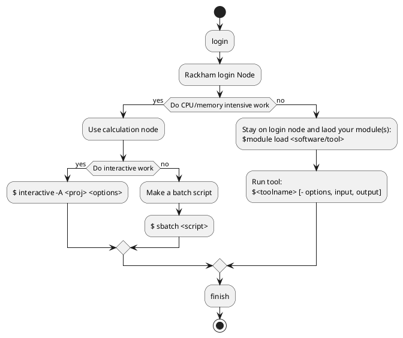

# Working with the modules on Bianca

!!! info "Objectives" 

    - We'll go through the methods to work with the modules
    - We'll go through some typical workflows
       
- 800+ programs and packages are installed.
- To avoid chaos and collisions, they are managed by a **module system**.
- This system keeps installed software hidden by default, and users have to explicitly tell their terminal which version of which software they need.
- The modules are most often available across cluster (except for Miarka)


!!! warning 
    - Bioinformatics tools require loading the “bioinfo-tools” module first.


### Modules

- [Software at UPPMAX](https://www.uppmax.uu.se/resources/software/)
- [Module system](https://www.uppmax.uu.se/resources/software/module-system/)

#### Some commands

- list all available modules (also bio-informatics if `bioinfo-tools` is loaded)
    - `module avail` or `ml av`

- Search for modules (full name not needed and case insensitive) 
    - `module avail <part of tool name>` or `ml av <part of toolname>`

- Load a module 
    - `module load <module name>` or `ml <module name>`

- Unload a module 
    - `module unload <module name>` or `ml -<module name>`

- List loaded modules 
    - `module list` or `ml`

- Display a brief module-specific help (not available for all modules)
    - `module help <module name>` or `ml help <module name>` 
 
- Search (like `avail`) but otherwise hidden modules (`bioinfo-tools` and Easybuild modules) 
    -  `module spider <part of tool name>` or `ml spider <module name>` 

### Installed software
- You can also find (almost) all installed software at:
    - <https://www.uppmax.uu.se/resources/software/installed-software/>
  
### Installed databases
- [Installed databases at UPPMAX](https://www.uppmax.uu.se/resources/databases/)
    
## Workflows    

**Change this example**    
???+ question "Hands on using a tool""

    1. use matlab

    ```
    $ matlab &
    ```
    - Does not work!
    - Load module first
    ```
    $ module avail matlab
    
    $ module load matlab/R2020b
    
    $ matlab &
    ```
    - Matlab starts
    - `module load matlab` will start default version (often latest)

    2. use Samtools

    ```
    $ module load samtools
    ```
    "These module(s) or extension(s) exist but cannot be loaded as requested: "samtools""
    ```
    module load bioinfo-tools samtools
    ```
    - Bioinformatic tools are hidden by default

### R

### GATK

### SNIPF

### Conda

- just loading procedure
- more in afternoon

### Common problems

- Conda environment clash with loaded python modules
- Forgotten environment variables defined in your `.bashrc` may give unexeptected errors when you run other programs or new versions of a program
- A full ``$HOME`` folder may cause unexpected errors
  - check with ``uquota``

### Jupyter

- ?? Not shown here but presented in [Extra material](https://uppmax.github.io/bianca_workshop/jupyter/)

## Summary

!!! info "``$HOME`` dir and project dir"

    **Quota**
    - Disk usage and number of files
    - check with `quota`
    - ``$HOME`` has always 32 GB and 300,000 files
    - Compute projects both have disk space (512 GB) and computing time attached to them

    **Core hours**
    - You  get core hours only from compute project
    - check with ``projinfo``
    - When they are used you can still get "BONUS" jobs if the resources allow.

- Use your disk spaces wisely
    - home folder just for general stuff and files needed by several projects
       - always read and write protected for others by default
    - otherside project folder which will more easily become public for other's
       - by default available for all project members.
- Use the computing resources wisely
    - low intensity work on login node
    - high intensity work on compute nodes (core hours are counted)
        - for development use the interactive sessions

## What kind of work will you perform?



!!! info
   
    More info about reaching the compute nodes in the afternoon!

## Common problems

- Conda environment clash with loaded python modules
- Forgotten environment variables defined in your `.bashrc` may give unexeptected errors when you run other programs or new versions of a program
- A full ``$HOME`` folder may cause unexpected errors
  - check with ``uquota``


**To extend**
!!! abstract "keypoints"
    
    - Centrally installed software are reached through the module system and available throughout all nodes. 
    - Your own installed software, scripts, python packages etcetera are available from their paths.
    
