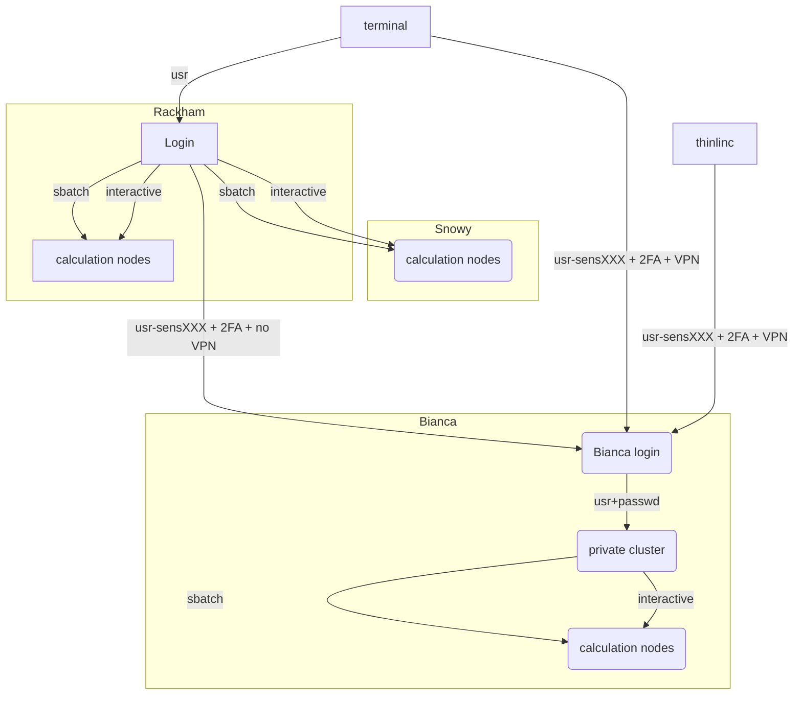

# Overview

!!! info "Objectives"
    - We'll get an overview of UPPMAX and SNIC/NAISS and how a computer cluster works

**UPPMAX = UppMACS**
- [Uppsala Multidisciplinary Center for Advanced Computational Science](http://uppmax.uu.se)

## NAISS
- [**National Academic Infrastructure for Supercomputing in Sweden**](https://www.naiss.se/)
- Mission: to provide a quality high-performance computing environment nationally

- Starting 1 January 2023, the National Academic Infrastructure for Supercomputing in Sweden (NAISS) is the new organization for high-performance computing, storage, and date services for academic users in Sweden. 
- From the users perspective, there will initially only be minimal differences between the SNIC and NAISS regimes.
    - FAQ:s — <https://www.naiss.se/>
- Application rounds: <https://www.naiss.se//#application-rounds-for-compute-and-storage-resources>
- NAISS and Uppsala University fund UPPMAX — UU’s supercomputing center.

## UPPMAX missions
- Runs the clusters placed in Uppsala.
- More details in the afternoon about Organisational orienteering!

    
## UPPMAX systems

- Clusters
    - Rackham (general purpose)
        - Snowy (Long runs and GPU:s)
    - **Bianca (sensitive data)**
        - Miarka (new for LifeScience)
- Storage
    - On-load directly connected to the clusters
    - Off-load for large data not needed for computation analysis anymore
- Cloud
    - Dis (region EAST-1)

## High Performance Computing — HPC
### What is a cluster?

- A network of computers, each computer working as a **node**.

- From small scale RaspberryPi cluster... 
     

- To supercomputers like Rackham.

- Each node contains several processor cores and RAM and a local disk called scratch.

- The user logs in to **login nodes**  via Internet through ssh or Thinlinc.

  - Here the file management and lighter data analysis can be performed.

- The **calculation nodes** have to be used for intense computing. 

## Summary about the three "common" UPPMAX clusters

| |Rackham|Snowy|Bianca|
|-------|-----|------|---|
|**Purpose**|General-purpose|General-purpose|Sensitive|
|**#  Nodes (Intel)**|486+144|228+  50 Nvidia T4 GPUs|288 +   10 nodes á 2  NVIDIA A100 GPUs|
|**Cores per node**|20/16|16|16/64|
|**Memory per node**|128 GB|128 GB|128 GB
|**Fat nodes**|256 GB & 1 TB| 256, 512 GB & 4 TB| 256 & 512 GB|
|**Local disk (scratch)**|2/3 TB| 4 TB| 4 TB |
|**Login nodes**|Yes| No (reached from Rackham)|Yes (2 cores and 15 GB)|
|**"Home" storage**|Domus|Domus|Castor|
|**"Project" Storage**|Crex, Lutra|Crex, Lutra|Castor|

## Overview of the UPPMAX systems

!!! abstract "keypoints"
    - NAISS makes available large-scale high-performance computing resources, storage capacity, and advanced user support, for Swedish research. 
    - UPPMAX runs the local resources placed at Uppsala Universty
    - A cluster consists of several inter-connected computers that can work individually or together.

