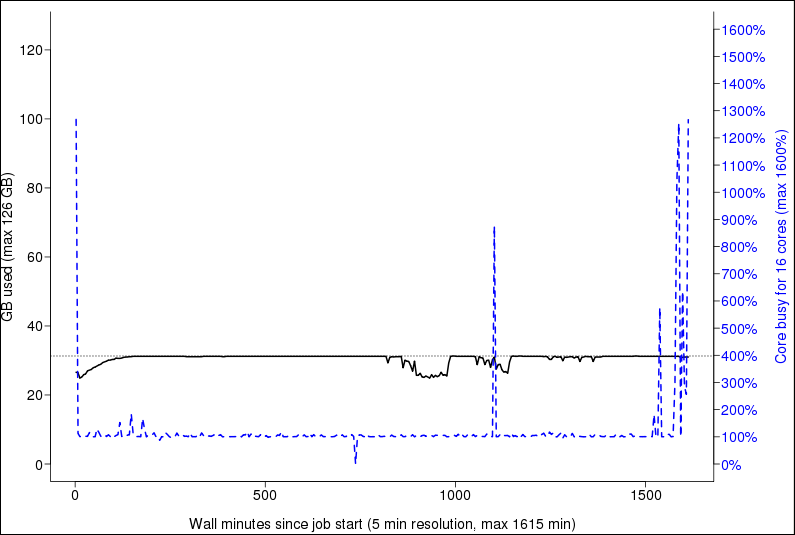

# Profiling

## CPU

### jobstats



```bash
jobstats --plot [jobid]
```
Read more : https://docs.uppmax.uu.se/software/jobstats/

### htop
### projplot


```bash
projplot -A [project_code]
```
Read more : https://docs.uppmax.uu.se/software/projplot/

## GPU

### nvidia-smi


```bash
nvidia-smi dmon -o DT
nvidia-smi --format=noheader,csv --query-compute-apps=timestamp,gpu_name,pid,name,used_memory --loop=1 -f sample_run.log
```

### nvtop


[image source](https://tilburgsciencehub.com/topics/automation/replicability/cloud-computing/monitor-memory-vm/)

```bash
module load nvtop
nvtop
```

### Pytorch
#### memory_viz

CUDA OOMs memory snapshot and memory profiler  


Start: `torch.cuda.memory._record_memory_history(max_entries=100000)`  
Save: `torch.cuda.memory._dump_snapshot(f"{file_name}.pickle")`  
Stop: `torch.cuda.memory._record_memory_history(enabled=None)`  
To visualize the snapshot file, PyTorch has a tool hosted at https://pytorch.org/memory_viz. 

Reach more : https://pytorch.org/blog/understanding-gpu-memory-1/


### Tensorflow
#### Tensorboard
`tensorboard` and `tensorboard-data-server` are available as a module :
```bash
module load python_ML_packages/3.11.8-cpu
tensorboard --bind_all --logdir=./tensorboard-log-dir
```
or 
```bash
module load python_ML_packages/3.9.5-gpu
tensorboard --bind_all --logdir=./tensorboard-log-dir
```

Read more : https://uppmax.github.io/uppmax4DL/tensorboard/


